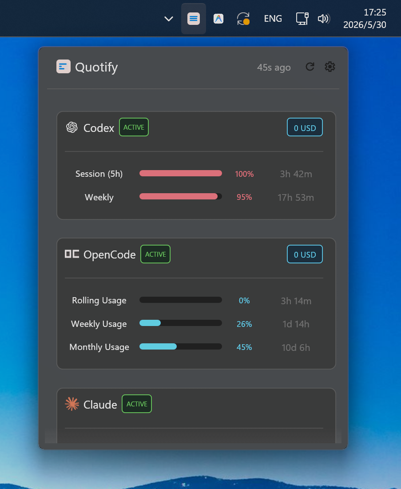

# Quotify

Quotify is a small Windows tray app for checking AI provider quota usage.

It shows a compact flyout with provider status, reset times, and a tray icon that can reflect a primary provider. The app is Windows-only and uses Win32 APIs with an `egui` popup UI.

Quotify is inspired by [CodexBar](https://github.com/steipete/CodexBar), especially its practical approach to surfacing provider usage in a lightweight desktop utility.

## Screenshots



## Providers

Supported providers:

- Codex/OpenAI
- OpenCode Zen/Go
- Claude
- Gemini/Antigravity
- Github Copilot
- DeepSeek
- Moonshot/Kimi
- z.ai
- Xiaomi MiMo
- Alibaba Token Plan
- MiniMax
- StepFun
- Windsurf
- Cursor
- Amp
- Augment
- Kiro
- Kilo Code
- Ollama
- OpenRouter
- Azure OpenAI
- AWS Bedrock
- Vertex AI
- Mistral
- Grok

Authentication is intentionally explicit. Browser cookie scraping is not used. Configure credentials through `quotify.toml` or environment variables.

## Usage

Create a default config:

```powershell
cargo run -- init
```

Fetch provider usage once:

```powershell
cargo run -- fetch
cargo run -- fetch --provider claude
```

Run the tray app:

```powershell
cargo run -- tray
```

Build an optimized release binary:

```powershell
cargo build --release
```

## Configuration

The default config path is:

```text
%APPDATA%\quotify\quotify.toml
```

See `config.example.toml` for available fields. Common environment variables include 
 - `OPENCODE_AUTH_COOKIE`
 - `OPENCODE_WORKSPACE_ID`
 - `CLAUDE_ACCESS_TOKEN`
 - `CLAUDE_SESSION_KEY`
 - `GEMINI_API_KEY`
 - `GOOGLE_API_KEY`
 - `OPENAI_ADMIN_KEY`
 - `OPENAI_API_KEY`
 - `DEEPSEEK_API_KEY`
 - `OPENROUTER_API_KEY`
 - `MOONSHOT_API_KEY`
 - `ELEVENLABS_API_KEY`
 - `ARK_API_KEY`
 - `Z_AI_API_KEY`
 - `VENICE_API_KEY`
 - `CROF_API_KEY`
 - `SYNTHETIC_API_KEY`
 - `WARP_API_KEY`
 - `GROQ_API_KEY`
 - `DEEPGRAM_API_KEY`
 - `LLM_PROXY_API_KEY`
 - `CODEBUFF_API_KEY`
 - `KIRO_API_KEY`
 - `GITHUB_COPILOT_TOKEN`
 - `AZURE_OPENAI_API_KEY`
 - `OLLAMA_API_KEY`
 - `MINIMAX_API_KEY`
 - `KIMI_AUTH_TOKEN`
 - `KILO_API_KEY`
 - `AUGMENT_SESSION_TOKEN`
 - `CODEXBAR_BEDROCK_BUDGET`
 - `GOOGLE_CLOUD_PROJECT`
 - `STEPFUN_TOKEN`
 - `ABACUS_COOKIE`
 - `ALIBABA_TOKEN_PLAN_COOKIE`
 - `T3_CHAT_COOKIE`
 - `AMP_COOKIE`
 - `MISTRAL_API_KEY`
 - `XAI_API_KEY`
 - `CURSOR_COOKIE`
 - `FACTORY_API_KEY`
 - `WINDSURF_SERVICE_KEY`
 - `MIMO_SERVICE_TOKEN`
 - `MIMO_COOKIE_HEADER`.


Provider card order is controlled by `[general].provider_order`. In the tray popup
 long-press and drag a provider card to reorder it; the new order is saved back to the config.

For explicit network proxying, set `[network].proxy` to an HTTP or SOCKS5 URL, for example `http://127.0.0.1:7890` or `socks5://127.0.0.1:7890`.

## License

MIT. See `LICENSE`.
