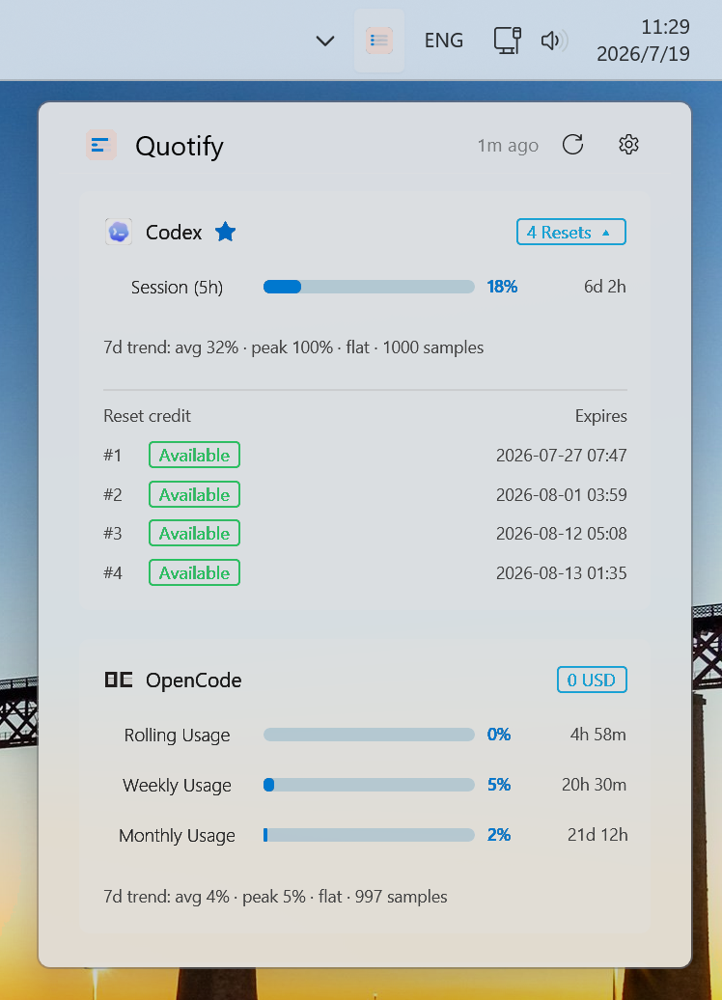

# Quotify

[](https://www.microsoft.com/windows)
[](LICENSE)
[](https://github.com/zuoxinyu/quotify/actions)

Quotify is a lightweight Windows system tray application designed to monitor your API usage quotas across various AI providers. It displays a compact, beautiful popup flyout showing your current consumption, remaining credits, and quota reset times.

Quotify is heavily inspired by [CodexBar](https://github.com/steipete/CodexBar) and brings a native, modern, and secure solution for Windows developers to keep track of their AI budgets at a glance.

---

## 📸 Screenshots



---

## ✨ Core Features

* **GPUI-powered UI**: Renders a premium, GPU-accelerated, high-performance interface built using the modern `GPUI` framework (developed by the Zed team).
* **Mica & Fluent Aesthetics**: Implements native Windows 11 DWM Mica backdrop effects with semi-transparent card layouts.
* **Windows Credential Manager Security**: API keys, session tokens, and browser cookies are securely stored using Windows Credential Manager (`quotify/<provider>/<field>`), ensuring no secrets are stored in plain text.
* **Smart Local History Caching**: Usage snapshots are cached locally in `%APPDATA%\quotify\usage-history.json` so you can instantly view your last fetched usage stats while background fetch is running.
* **Interactive Drag-to-Reorder**: Reorder provider cards directly in the UI with a simple long-press and drag action. Your custom order is automatically updated in the config file.
* **Windows Desktop Facilities**: Supports running as a single instance, automatically registering to start with Windows, and writing rotating daily diagnostic logs to `%APPDATA%\quotify\logs`.
* **CDP Cookie Synchronizer**: Includes a PowerShell script to fetch and sync session cookies via Chrome DevTools Protocol (CDP) for providers that require active browser sessions.

---

## 🤖 Supported Providers

Quotify supports over 25 different AI models, services, and developer tools, categorized below:

### General & Custom LLM Providers
* **Claude / Anthropic** (Session keys, cookies, or API keys)
* **Gemini / Antigravity**
* **OpenAI / Codex**
* **DeepSeek**
* **OpenRouter**
* **Mistral**
* **Grok / xAI**
* **z.ai**
* **MiniMax**

### Coding Assistants
* **GitHub Copilot** (OAuth token)
* **Cursor** (Session cookies)
* **Windsurf / Codeium** (Service keys)
* **Augment** (Session token)
* **Codebuff**
* **Kiro**
* **Kilo Code**

### Cloud & Local Hostings
* **Azure OpenAI**
* **AWS Bedrock**
* **Vertex AI / Google Cloud**
* **Ollama** (Local API)

### Regional & Specialized Platforms
* **OpenCode Zen/Go**
* **Xiaomi MiMo**
* **Alibaba Token Plan**
* **StepFun**
* **Amp**

---

## 🚀 Getting Started

### Prerequisites

* Windows 10/11 (Building on non-Windows systems will fail)
* Rust toolchain (Edition 2024, Rust $\ge$ 1.85)

### Running Locally

1. **Initialize the Default Configuration**:
   ```powershell
   cargo run -- init
   ```
   This creates your local configuration folder and writes a default template.

2. **Verify Configuration & Fetch Quotas**:
   ```powershell
   # Fetch all configured providers
   cargo run -- fetch
   
   # Fetch a specific provider
   cargo run -- fetch --provider claude
   ```

3. **Start the System Tray App**:
   ```powershell
   cargo run -- tray
   ```

4. **Build a Production Release**:
   ```powershell
   cargo build --release
   ```
   *Optimized with `opt-level = "z"`, LTO, and stripped symbols for a compact binary.*

---

## ⚙️ Configuration & Security

The configuration directory is located at:
```text
%APPDATA%\quotify\
```

* **`quotify.toml`**: Stores non-sensitive settings like refresh intervals, proxy setup, and active provider ordering. See `config.example.toml` for options.
* **Credential Manager**: Secret fields (API keys, cookies) configured via the settings UI are saved securely under Windows Credential Manager.

> [!TIP]
> **Explicit Network Proxying**  
> If you are behind a firewall, you can set `[network].proxy` in your `quotify.toml` to redirect requests. It supports HTTP, HTTPS, and SOCKS5 proxies:
> ```toml
> [network]
> proxy = "socks5://127.0.0.1:7890"
> ```

---

## 🍪 CDP Cookie Sync Helpers

Some providers (e.g. OpenCode, MiMo, Cursor) require active browser cookies. We provide an interactive PowerShell helper script to automate retrieving these cookies via Chrome DevTools Protocol:

```powershell
# Run the interactive setup flow
.\scripts\get_cdp_cookies.ps1
```

### Script Usage Examples

* **Fetch and sync cookies for a specific provider**:
  ```powershell
  .\scripts\get_cdp_cookies.ps1 -Provider mimo -OpenChrome -Sync
  ```
* **Sync from an already running Chrome session with remote debugging (port 9222)**:
  ```powershell
  .\scripts\get_cdp_cookies.ps1 -Domain platform.xiaomimimo.com -Sync
  ```

---

## 🛠️ CI/CD Workflow

This project includes a pre-configured GitHub Actions workflow:
* **CI Checks**: Automatically runs code formatting checks (`cargo fmt`), clippy lints (`cargo clippy`), and runs unit tests on a Windows runner for every pull request and push to the main branches.
* **Automatic Releases**: When you push a version tag (e.g., `v0.2.0`), GitHub Actions will compile the production binary, create a new GitHub Release, and automatically upload the compiled `quotify.exe` as an asset.

> [!NOTE]
> **How to release a new version**:
> ```bash
> git tag v0.2.0
> git push origin v0.2.0
> ```

---

## 📄 License

This project is licensed under the MIT License. See [LICENSE](LICENSE) for details.
