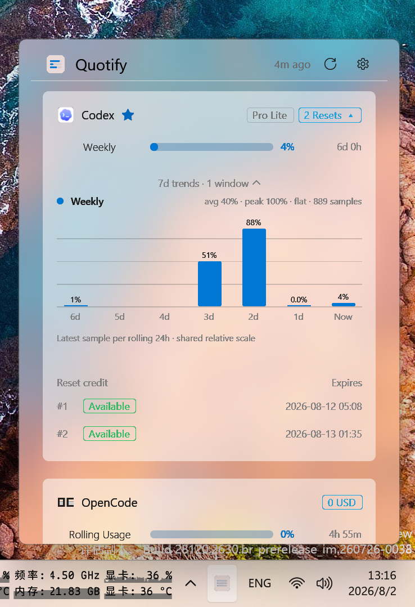

# Quotify

[](https://www.microsoft.com/windows)
[](LICENSE)
[](https://github.com/zuoxinyu/quotify/actions)

Quotify is a lightweight Windows system tray application designed to monitor your API usage quotas across various AI providers. It displays a compact, beautiful popup flyout showing your current consumption, remaining credits, and quota reset times.

Quotify is heavily inspired by [CodexBar](https://github.com/steipete/CodexBar) and brings a native, modern, and secure solution for Windows developers to keep track of their AI budgets at a glance.

---

## 📸 Screenshots



---

## ✨ Core Features

* **GPUI-powered UI**: Uses `GPUI` and `gpui-component` for a GPU-accelerated interface with standard inputs, selectors, switches, sliders, tags, and buttons.
* **Configurable Windows Materials**: Supports system/light/dark themes and explicit Mica, Mica Alt, Acrylic, or no backdrop while preserving the native Windows 11 DWM material layer.
* **Native Flyout and Window Modes**: Runs as a taskbar-anchored animated flyout in normal use, or as a regular resizable `Quotify Window` for accessibility and UI automation.
* **Windows Credential Manager Security**: API keys, session tokens, and browser cookies are securely stored using Windows Credential Manager (`quotify/<provider>/<field>`), ensuring no secrets are stored in plain text.
* **WebView Login Fallback**: OpenCode, MiMo, and Ollama can acquire and securely store credentials through an embedded WebView2 session. Automatic login can be disabled so authentication starts only from the provider card's login button.
* **Consent-based Agent Discovery**: On first launch, Quotify asks before checking known local credential locations, environment variables, and installed coding-agent CLIs. Discovery stays local and can be changed or rerun from Settings.
* **Smart Local History Caching**: Usage snapshots are cached locally in `%APPDATA%\quotify\usage-history.json` so you can instantly view your last fetched usage stats while background fetch is running.
* **Per-window Usage History**: Session, weekly, monthly, billing-cycle, and budget windows retain independent semantic histories even when an upstream provider renames or moves a quota field.
* **Expandable Usage Trends**: Each provider card can expand its 7-day trend summary into one grouped histogram with a color legend for every quota window, while preserving gaps where no samples were recorded.
* **Direct Drag-to-Reorder**: Drag a provider card to move it directly through the list without a separate preview. The resulting order is stored in the config file.
* **Provider Validation in Settings**: The searchable provider selector is alphabetized, supports setting the primary provider, and can test credentials through the same real fetch path used by the background service.
* **Native Windows Notifications**: Optionally receive quota-reset, usage-threshold, and silent background-refresh failure notifications through Windows. Notifications are completely disabled by default.
* **Windows Desktop Facilities**: Supports running as a single instance, automatically registering to start with Windows, and writing rotating daily diagnostic logs to `%APPDATA%\quotify\logs`.
* **CDP Cookie Synchronizer**: Includes a PowerShell script to fetch and sync session cookies via Chrome DevTools Protocol (CDP) for providers that require active browser sessions.

---

## 🤖 Supported Providers

Quotify's current catalog mirrors the 66-provider CodexBar snapshot used by the
project through 65 provider cards. OpenCode and OpenCode Go intentionally share
one card, configuration, cookie, and history identity.

### General & Custom LLM Providers

Claude, Codex, OpenAI, Gemini, Antigravity, DeepSeek, OpenRouter, Moonshot,
Mistral, Grok, z.ai, MiniMax, Kimi, StepFun, Doubao, Venice, Crof, Synthetic,
and xAI.

### Coding Assistants

OpenCode, ClinePass, GitHub Copilot, Cursor, Windsurf, Factory Droid, Devin,
Zed, Command Code, Qoder, Codebuff, Kiro, Kilo Code, Augment, JetBrains AI,
Amp, and MiMo.

### Cloud & Local Hostings

Azure OpenAI, AWS Bedrock, Vertex AI, Ollama, LiteLLM, LLM Proxy, sub2api,
ClawRouter, Wayfinder, DeepInfra, and GroqCloud.

### Regional & Specialized Platforms

ElevenLabs, Warp, Deepgram, Abacus AI, Alibaba Token, Alibaba Coding Plan,
Qwen Cloud, T3 Chat, Manus, Perplexity, Poe, Sakana AI, Chutes, NeuralWatt,
LongCat, ZenMux, ai&, and ZoomMate.

Codex, Claude, the merged OpenCode integration, and Cursor retain their individual
quota windows (for example 5-hour/session, weekly, monthly, or billing-cycle lanes)
rather than collapsing a provider into one maximum percentage. Subscription tiers
are surfaced when the upstream response or local credentials expose them. Codex
windows are classified from their declared duration instead of assuming that
`primary_window` always means 5 hours: if OpenAI temporarily exposes only the
7-day quota in that field, Quotify continues to display and trend it as `Weekly`.
Available Codex reset credits and their expiration times are shown separately from
quota progress.

---

## 🚀 Getting Started

### Prerequisites

* Windows 10/11 (Building on non-Windows systems will fail)
* Rust toolchain (Edition 2024, Rust $\ge$ 1.85)

### Running Locally

1. **Initialize the Default Configuration**:
   ```powershell
   cargo run -- init
   ```
   This creates your local configuration folder and writes a default template.

2. **Verify Configuration & Fetch Quotas**:
   ```powershell
   # Fetch all configured providers
   cargo run -- fetch
   
   # Fetch a specific provider
   cargo run -- fetch --provider claude
   ```

3. **Start the System Tray App**:
   ```powershell
   cargo run -- tray
   ```

4. **Open a Regular Window for UI Validation**:
   ```powershell
   cargo run -- window
   ```
   This opens a normal, resizable `Quotify Window` that uses the real local
   configuration and provider data without creating another tray icon, writing
   duplicate history samples, or sending notifications. It can run alongside
   the tray app and provides a stable window target for accessibility and UI
   automation tools.

5. **Build a Production Release**:
   ```powershell
   cargo build --release
   ```
   *Optimized with `opt-level = "z"`, LTO, and stripped symbols for a compact binary.*

---

## ⚙️ Configuration & Security

The configuration directory is located at:
```text
%APPDATA%\quotify\
```

* **`quotify.toml`**: Stores non-sensitive settings like refresh intervals, proxy setup, and active provider ordering. See `config.example.toml` for options.
* **Credential Manager**: Secret fields (API keys, cookies) configured via the settings UI are saved securely under Windows Credential Manager.

### Local Agent Discovery

New installations do not scan automatically. The first-launch onboarding prompt can enable a local scan and activate detected coding-agent providers. The scan checks only known local credential locations, environment variables, and installed CLI commands; it does not upload credentials or file contents.

Discovery can be disabled or rerun from **Settings → General Settings → Local Agent Discovery**. When disabled, Quotify refreshes only providers that were explicitly enabled in Provider Settings.

### Appearance and WebView Login

The Settings page exposes `system`, `dark`, and `light` themes plus `Mica`,
`Mica Alt`, `Acrylic`, and `None` backdrop choices. Their equivalent config
values are stored under `[general]`:

```toml
[general]
theme = "system"
backdrop = "mica_alt"
auto_webview_login = true
```

When automatic WebView login is enabled, a supported provider can open WebView2
after its saved credentials are missing or rejected. When it is disabled, the
provider card shows a login action after authentication fails. OpenCode reuses
the persistent WebView profile and, when a workspace ID is known, resumes at
`https://opencode.ai/workspace/{workspace_id}/go`.

### Windows Notifications

All notifications are disabled by default. Set the master `enabled` switch and then opt in to only the events you want:

```toml
[notifications]
enabled = false
monthly_resets = false
weekly_resets = false
five_hour_resets = false
usage_threshold_enabled = false
usage_threshold_percent = 80.0
silent_refresh_failures = false
```

Reset notifications are emitted after a refresh detects that a provider's monthly, weekly, or 5-hour quota has reset. Threshold notifications use the provider's reported usage percentage. `silent_refresh_failures` covers failed background refreshes that would otherwise have no visible UI. Windows notification and quiet-hours settings are respected.

### 30-Day API Budgets

30-day budgets are ordinary, non-sensitive configuration values and remain in `quotify.toml`; they are not stored in Credential Manager. Only positive USD amounts are used:

```toml
[provider_budgets]
openai = 100.0
claude = 100.0
bedrock = 100.0
```

Budget progress is supported for OpenAI, the Claude Admin API, AWS Bedrock,
DeepInfra, LiteLLM, ClawRouter, ai&, and xAI when the provider returns a
compatible USD spend window. OpenAI, Claude, Bedrock, ai&, and xAI use the latest
30-day spend window: OpenAI, Claude, and Bedrock query the latest 30 complete UTC
days, while ai& and xAI use their upstream 30-day totals. Providers with a native
monthly/budget response retain that upstream window. Subscription quota data or
balance-only responses are not treated as spending. If spend data is unavailable,
the card shows `Budget unavailable`; opted-in silent-refresh failure notifications
fire once on that failure edge.

Omitting a provider removes its configured budget. The legacy `CODEXBAR_BEDROCK_BUDGET` environment variable remains accepted as an external fallback, but `[provider_budgets].bedrock` is preferred. Unset the environment variable as well when you want to disable a budget that was supplied through it.

> [!TIP]
> **Explicit Network Proxying**  
> If you are behind a firewall, you can set `[network].proxy` in your `quotify.toml` to redirect requests. It supports HTTP, HTTPS, and SOCKS5 proxies:
> ```toml
> [network]
> proxy = "socks5://127.0.0.1:7890"
> ```

---

## 🍪 CDP Cookie Sync Helpers

Some providers require active browser cookies. In addition to the built-in
WebView2 login path for OpenCode, MiMo, and Ollama, an interactive PowerShell
helper can import cookies from a Chrome DevTools Protocol session. This is also
useful for providers such as Cursor that do not use the built-in WebView flow:

```powershell
# Run the interactive setup flow
.\scripts\get_cdp_cookies.ps1
```

### Script Usage Examples

* **Fetch and sync cookies for a specific provider**:
  ```powershell
  .\scripts\get_cdp_cookies.ps1 -Provider mimo -OpenChrome -Sync
  ```
* **Sync from an already running Chrome session with remote debugging (port 9222)**:
  ```powershell
  .\scripts\get_cdp_cookies.ps1 -Domain platform.xiaomimimo.com -Sync
  ```

---

## 🛠️ CI/CD Workflow

This project includes a pre-configured GitHub Actions workflow:
* **CI Checks**: Automatically runs code formatting checks (`cargo fmt`), clippy lints (`cargo clippy`), and runs unit tests on a Windows runner for every pull request and push to the main branches.
* **Automatic Releases**: When you push a `vX.Y.Z` version tag, GitHub Actions will compile the production binary, create a new GitHub Release, and upload `quotify.exe` as an asset.

> [!NOTE]
> **How to release a new version** (replace `X.Y.Z` with the version from
> `Cargo.toml`):
> ```bash
> git tag vX.Y.Z
> git push origin vX.Y.Z
> ```

---

## 📄 License

This project is licensed under the MIT License. See [LICENSE](LICENSE) for details.
